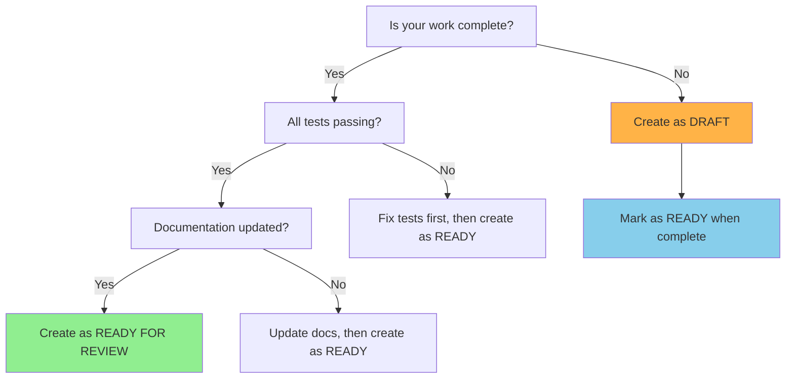
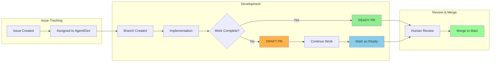
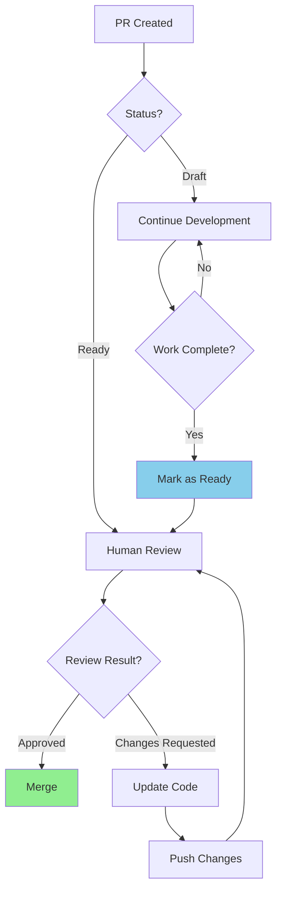

# PR Status Rules - Single Source of Truth

## Quick Decision Tree



## PR Status Guidelines

### ✅ **READY FOR REVIEW** (Default)
Use when ALL of the following are true:
- ✅ **Work is complete** - feature/fix is fully implemented
- ✅ **Tests pass** - all automated tests are green
- ✅ **Documentation updated** - relevant docs reflect changes
- ✅ **Code is clean** - follows project style and patterns
- ✅ **Ready for human review** - you're confident in the implementation

**Command:**
```bash
gh pr create --title "[Type]: Brief description" \
  --body-file .github/pull_request_template.md \
  --base main \
  --head [branch-name]
```

### 🚧 **DRAFT** (Use Sparingly)
Only use when:
- 🔄 **Work in progress** - implementation is incomplete
- 🤝 **Need early feedback** - require input before continuing
- 🧪 **Proof of concept** - testing approach before full implementation
- 🚫 **Blocking issues** - waiting for dependencies

**Command:**
```bash
gh pr create --draft --title "WIP: Brief description" \
  --body-file .github/pull_request_template.md \
  --base main \
  --head [branch-name]
```

**Transition to Ready:**
```bash
gh pr ready [pr-number]
```

## Agent-Specific Rules

### 🤖 **GitHub Copilot Coding Agents**
- **Default behavior**: Create PRs as **READY FOR REVIEW**
- **Most single-issue tasks** should be completed before PR creation
- **Only use DRAFT** for:
  - Multi-part features requiring incremental review
  - Large refactors needing intermediate feedback
  - Issues blocked by external dependencies

### 👨‍💻 **Human Developers**
- Follow same rules as agents
- **DRAFT is acceptable** for collaborative work
- **Always transition to READY** when implementation is complete

## Human Workflow Visibility

### PR Pipeline Overview


### Status Indicators for Technical Leads

| Status | Indicator | Meaning | Action Needed |
|--------|-----------|---------|---------------|
| 🟢 Ready for Review | Green badge | Work complete, needs review | Review and approve/request changes |
| 🟡 Draft | Yellow badge | Work in progress | Monitor progress, provide feedback if requested |
| 🔵 Changes Requested | Blue badge | Review feedback given | Wait for developer updates |
| 🟣 Approved | Purple badge | Ready to merge | Merge when appropriate |

## Edge Cases & Troubleshooting

### Common Confusion Points

**Q: Tests are passing but I'm not sure about the implementation**
**A:** Create as READY - that's what code review is for

**Q: Work is complete but there are merge conflicts**
**A:** Resolve conflicts first, then create as READY

**Q: Implementation is done but I want to add more features**
**A:** Create READY PR for current work, create new issue for additional features

**Q: Large feature that will take multiple days**
**A:** Break into smaller issues OR create DRAFT and update regularly

### Resolution Workflow



## Implementation Timeline

### For GitHub Copilot Agents
1. **Issue Assignment** → **15-20 minutes** → **READY PR**
2. If exceeding 20 minutes → Create DRAFT with status comment
3. When work complete → Mark as READY

### Quality Gates
- ✅ All automated tests pass
- ✅ Code follows ESLint rules (`yarn lint:all`)
- ✅ Documentation updated
- ✅ PR template completed

## References

- **Primary Source**: This document (`.github/PR_STATUS_RULES.md`)
- **Agent Instructions**: `.copilot-instructions.md`
- **Workflow Details**: `.github/COPILOT_WORKFLOW.md`
- **PR Template**: `.github/pull_request_template.md`

---

**Last Updated**: $(date +%Y-%m-%d)  
**Authority**: Technical Product Manager  
**Scope**: All contributors (agents and humans)