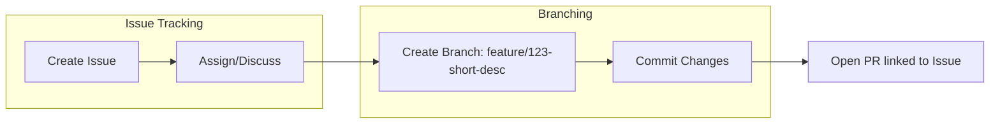
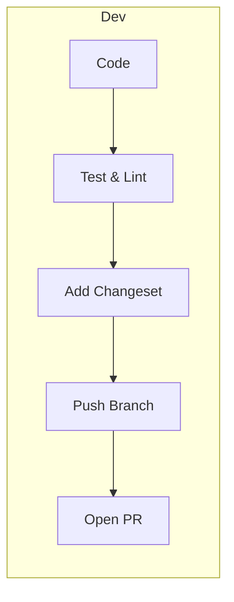
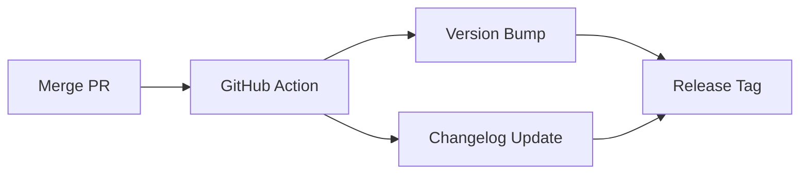
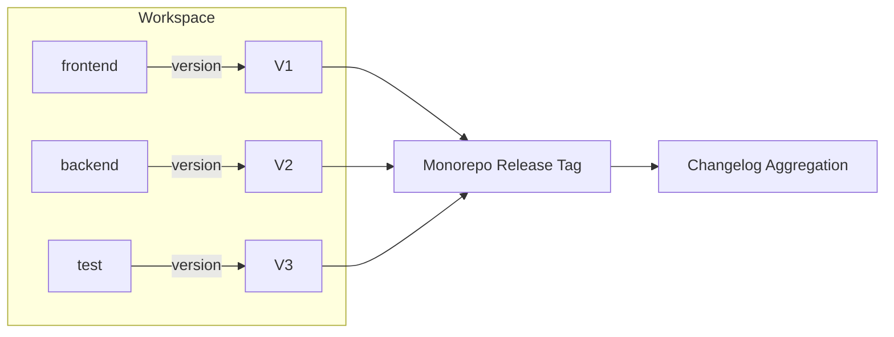
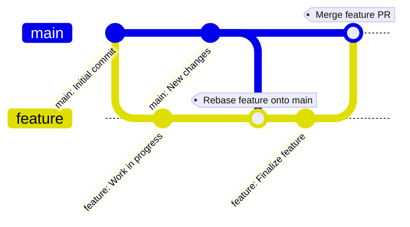

# Contributing to shmup-yours


We use a monorepo with Yarn workspaces. Each workspace (frontend, backend, test) has its own version and changelog, but releases are tagged at the repo level. Version bumps and changelogs are automated using Changesets and GitHub Actions.

## GitHub Copilot Coding Agent Workflow

**For AI Agent Implementation:**
1. **Create Issue:** Use templates from `.github/ISSUE_TEMPLATE/`
2. **Assign to Copilot:** Add `@github-copilot` mention or `#github-pull-request_copilot-coding-agent` hashtag
3. **Agent Creates Branch:** Follows naming convention `feature/[issue-number]-[description]`
4. **Implementation:** Agent implements, tests, and documents according to task template
5. **Auto-PR Creation:** Agent opens PR using `.github/pull_request_template.md`
6. **Review & Merge:** Human review and merge after quality gates pass

**See `.github/COPILOT_WORKFLOW.md` for complete agent coordination details.**

## Manual Development Workflow

## Issue & Branch Workflow



- Create a GitHub issue for every feature, bug, or task.
- Name branches using the format: `feature/<issue-number>-short-desc` or `bugfix/<issue-number>-short-desc`.
- Link your pull request to the relevant issue for tracking.




### Step-by-Step
1. **Clone the repository and create a feature branch:**
   ```sh
   git checkout -b feature/<issue-number>-short-desc
   ```
2. **Make your changes in the appropriate workspace.**
3. **Run tests and lint checks locally:**
   ```sh
   yarn workspaces run test
   yarn workspaces run lint
   ```
4. **Add a changeset describing your change:**
   ```sh
   yarn changeset
   ```
   - Choose the affected packages and the type of version bump (patch, minor, major).
   - Write a brief description of your change.
5. **Push your branch and open a pull request.**
6. **Code review and approval.**
7. **Merge to main.**
   - Write a brief description of your change.

## Release Workflow



8. **GitHub Action runs on main:**
   - Reads all changesets.
   - Bumps versions in affected `package.json` files.
   - Updates changelogs.
   - Creates a release commit and tag.
   - Optionally publishes packages (if configured).

## Versioning & Release Details



- Each workspace maintains its own version and changelog.
- The repo is tagged with a single release version after all bumps and changelogs are applied.
- Release notes aggregate changes from all workspaces.
        F1[frontend] -- version --> V1

## Best Practices

## Keeping Your Branch Up-to-Date & Avoiding Merge Conflicts

To avoid painful merge conflicts, regularly sync your feature branch with the latest changes from `main`. The recommended workflow is to rebase your branch onto `main` before opening a PR and whenever new changes land in `main`.

### Step-by-Step: Rebasing Your Feature Branch
1. Fetch the latest changes:
   ```sh
   git fetch origin
   ```
2. Rebase your branch onto main:
   ```sh
   git rebase origin/main
   ```
3. If you encounter conflicts, resolve them in your editor, then continue:
   ```sh
   git add <conflicted-files>
   git rebase --continue
   ```
4. After a successful rebase, force-push your branch:
   ```sh
   git push --force-with-lease
   ```

### Visualizing the Git Workflow


- Each workspace maintains its own version and changelog.
- The repo is tagged with a single release version after all bumps and changelogs are applied.
- Release notes aggregate changes from all workspaces.

## Best Practices
- Do not manually bump versions in `package.json`. Let Changesets and GitHub Actions handle this.
- Always add a changeset for any change that affects a workspace.
- Keep PRs focused and scoped to a single feature or fix when possible.
- Use clear, descriptive commit messages and changeset notes.

- Regular rebasing keeps your branch up-to-date and minimizes merge conflicts.
- Always resolve conflicts thoughtfully and test your changes after rebasing.
- If unsure, ask for help or open a draft PR for early feedback.

## References
- [Changesets Documentation](https://github.com/changesets/changesets)
- [Yarn Workspaces](https://classic.yarnpkg.com/en/docs/workspaces/)
- [GitHub Actions](https://docs.github.com/en/actions)
- [Semantic Versioning](https://semver.org/)

---

For questions or help, open an issue or ask in the project discussions!
